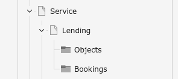
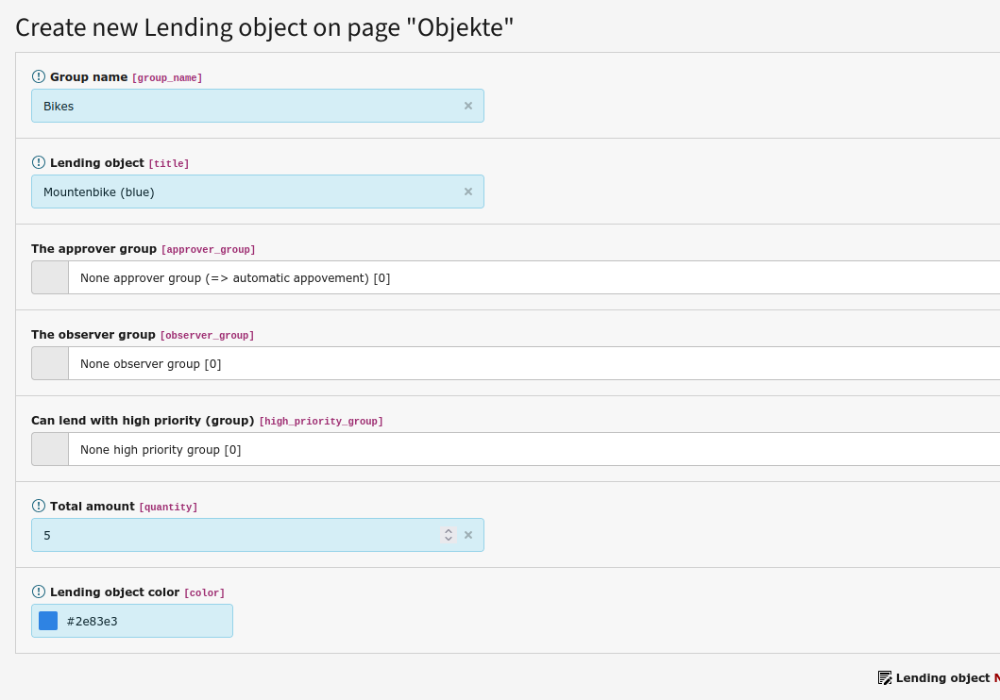
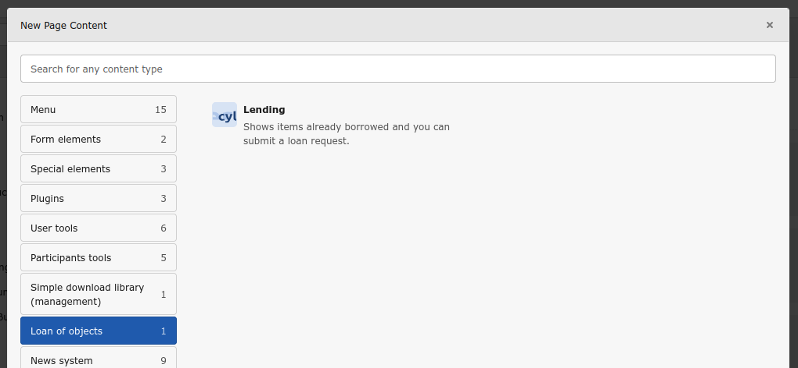
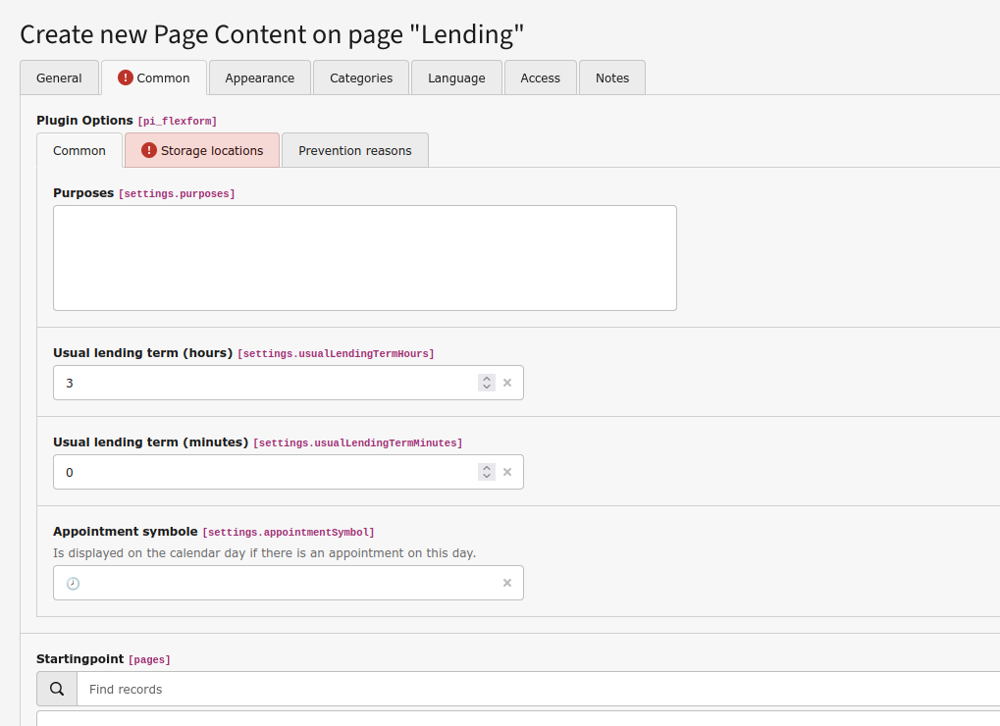

# TYPO3 extension :: cyLending

A simple TYPO3 extension for lending of objects.

With this extension you can organize the lending of objects. Front-end users can submit a loan request for one or more objects for a certain period of time. This request can go through a simple approval process or can also be approved automatically. A calendar shows which objects are already on loan and for which there are requests.
A warning is issued for loans that overlap in time. External appointment sources can also be integrated using a hook.

## Change log

* 5.1.0 :: UPD : You can set how many months you can scroll forward or backward.
* 5.0.3 :: FIX : Display the missing "other" lendings.
* 5.0.2 :: FIX : Removes unused constants.
* 5.0.1 :: FIX : Removes unused constants.
* 5.0.0 :: UPD : Change the all interactions to an ajax communication.
* 4.1.2 :: FIX : Fix the permant disbaled high priority flag.
* 4.1.1 :: UPD : Update (cleaning) TCA configuration
* 4.1.0 :: UPD : UI form: The max quantities are updated, if the object, from or until field is changed (AJAX)
* 4.0.0 :: UPD : Update to TYPO3 13 and Bootstrap 15.
* 3.3.0 :: ADD : After the lean request, you have an button for a new lean request
* 3.2.3 :: ADD : Add hyphens in the calendar detail view.
* 3.2.2 :: Fix : Lendings and availability request with a start date in the past are no longer displayed under “My lendings or “My availability requests”.
* 3.2.1 :: Fix : Replace "appointment symbole" with "appointment symbol".
* 3.2.0 :: ADD : You can set an individual appointment symbol.
* 3.1.0 :: ADD : You can cancel your availability request.
* 3.0.1 :: FIX : Calculation of all lending observer receiver is fixed.
* 3.0.0 :: UPD : Update to TYPO3 12 and Bootstrap 5.
* 2.1.1 :: FIX : Fix the separation between the group with high priority rights and the approver group.
* 2.1.0 :: UPD : Separate the configuration for high priority lendings authorization per object.
* 2.0.2 :: FIX : Small fix automatic approve function and max quantity setting of the group elements.
* 2.0.1 :: FIX : The automatic approve function works now.
* 1.4.0 :: UPD : Add sub lendings.
* 1.3.1 :: CHG : Add small border bottom to an event in the calendar.
* 1.3.0 :: UPD : Add ignore time overlapping function
* 1.2.9 :: CHG : The fix reduces unused detail times.
* 1.2.8 :: CHG : Detail show displays the times better.
* 1.2.7 :: UPD : High priority is persistent now.
* 1.2.6 :: FIX : Fix the time rendering in the calendar.
* 1.2.5 :: UPD : Approvers can create lendings with high priority. (Overrides exists lendings.)
* 1.2.4 :: FIX : Prevent two double requests (UI).
* 1.2.3 :: FIX : Better handling with deleted requests.
* 1.2.2 :: FIX : Prevent two different permits.
* 1.2.1 :: ADD : Make the configuration parser stable.
* 1.2.0 :: ADD : Add an reasons for prevention request API.
* 1.1.7 :: UPD : Release the flexform select tree level.
* 1.1.6 :: CHG : Change the storage uids strategy.
* 1.1.5 :: FIX : The approver tab displays data.
* 1.1.4 :: FIX : Not approved lendings are displayed stripped.
* 1.1.3 :: ADD : Add licence entry in the composer file.
* 1.1.2 :: FIX : Remove debug outputs.
* 1.1.1 :: FIX : Repaire the date format.
* 1.1.0 :: ADD : Add ajax connect for dynamic reloading of the events (lendings).
* 1.0.0 :: FIX : Fix the plugin registration/configuration.
* 0.9.8 :: FIX : Remove debug output
* 0.9.7 :: ADD : Make TypoScript available (always load)
* 0.9.6 :: FIX : Automatic approve
* 0.9.5 :: FIX : Object descriptions (translations)
* 0.9.4 :: ADD : Adds a limit of the next and the previous month button.
* 0.9.3 :: Initial beta version


## Documentation

With this extension you can organize lending objects to others.

### Features

* Calendar showing borrowed items and items with pending loan requests
* Items can be borrowed automatically or require an approval process
* You always have an overview of your loans and loan requests
* Approvers and other people can be notified about the loan process via email

### For editors

Here is a simple example of how to set up a rental.

Our items are five mountain bikes.

0. Create a directory structure (optional / recommended)

  This pages/folders structure has proven helpful:

  

1. Create the rental items (in the "Objects" folder)::


Notes:

* **Group name:** \
  If you specify a group name, your item will be assigned to that group later in the form.
* **Lending object** \
  This is the identifier of the loan item.
* **The approver group** \
  If an FE group is specified here, all members of that group will be notified that a loan request for this item has been made. The group members can approve the loan. If no group is specified, the loan is automatically approved.
* **The observer group** \
  If an FE group is specified here, all members of that group will be notified when a loan for this item is approved or rejected.
* **Can land with high priority** \
  If yes, these items can be borrowed with high priority. All existing loans during that period will be downgraded on request and the affected people will be notified by email.
* **Total amount** \
 If there are multiple items available for loan, you can specify that number here. When the quantity is 1, the item may be overbooked after confirming a warning (for example, if two events and two loans share a single item).
* **Lending object color** \
  The question entered here will be used in the calendar.

2. Create the lending service (FE plugin on the "Lending" page)

2.1. First step


2.2 Second step: Configure


Notes on **Common**:

* **Purposes** \
  You can provide loan reasons here to make input easier.
* **Usual lending term (hours / minutes)** \
  Hier kann die übliche Ausleihzeit angeben werden. Hilft bei der Ausleihanfrage.
* **Appointment symoble** \
  In the calendar, days with loans are marked with an icon. You can set the icon here.

Notes on **Storage locations**:

Here you can/should specify different storage locations:

* Where are the FE users and FE groups stored?
* Where are the loan items stored?
* Where should the loans and bookings be saved?
* Where are alternative bookings also stored?

Note on **Prevention reasons**:

Here another extension can provide reasons that argue against a loan. For this, the extension must implement a method (API):

``` php
public static function reasonsForPreventionAction(array $storageUids, \DateTime $from, \DateTime $until, string $visibility = 'ALL'): array
```

***Beispiel***
In this example the service of the extension `Cylancer\Participants` is queried. The request contains the selected Page UIDs and the time period.
